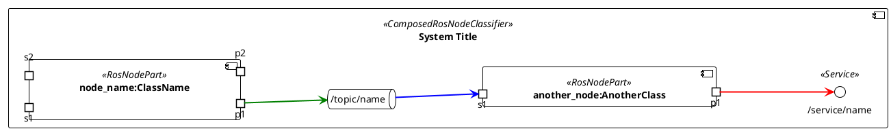
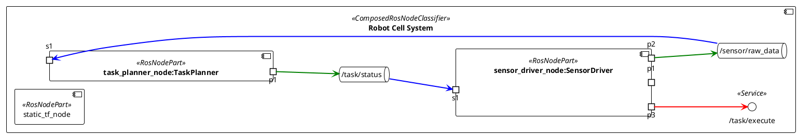

# ROS2 Architecture Diagram Generator — FLAT FORMAT GUIDE

## Your Job

You receive a FLAT architecture JSON object from Phase 3a. Your ONLY job is to convert it into a valid PlantUML diagram following the rules below. Do NOT re-read any source files. Do NOT re-parse launch files. **Trust the JSON completely — it is already fully resolved.**

**For the JSON object, produce exactly ONE `.puml` file.**

**OUTPUT: PlantUML ONLY. No JSON. No markdown. No explanation. Raw PlantUML starting with `@startuml`.**

---

## INPUT JSON STRUCTURE

The input is a SINGLE flat object with this structure:

```json
{
  "launch_file_name": "robot_cell.launch.py",
  "RosNodeParts": [
    {
      "id": "n1",
      "node_name": "sensor_driver_node",
      "class_name": "SensorDriver",
      "full_namespace": "/",
      "ports": [
        {
          "is_connected": true,
          "message_or_service_type": "sensor_msgs/msg/PointCloud2",
          "connected_topic_or_service_name": "/sensor/raw_data",
          "port_type": "Publisher",
          "identifier": "pub_1"
        }
      ]
    },
    ...more RosNodeParts...
  ],
  "topics": [
    {
      "message_type": "sensor_msgs/msg/PointCloud2",
      "topic_name": "/sensor/raw_data"
    },
    ...more topics...
  ],
  "services": [
    {
      "service_type": "example_interfaces/srv/Trigger",
      "service_name": "/task/execute"
    }
  ],
  "namespaces": ["/", "/sensors", "/planning"]
}
```

---

## DIAGRAM STRUCTURE — PORT-BASED RENDERING

This diagram uses **port-based wiring**. The structure is:



---

## PLANTUML HEADER — ALWAYS USE EXACTLY THIS

```plantuml
@startuml
!theme plain
left to right direction
skinparam packageStyle rectangle
```

No `title` line. No extra skin params.

---

## STEP-BY-STEP: HOW TO BUILD THE DIAGRAM

---

### STEP 1 — Open the Outer Component

Create a single outer component as the container for the entire system.

Use the launch_file_name to create a meaningful title and alias:
- `launch_file_name: "robot_cell.launch.py"` → title: "Robot Cell System", alias: `robot_cell_system`
- `launch_file_name: "perception.launch.py"` → title: "Perception System", alias: `perception_system`

```plantuml
component "Robot Cell System" as robot_cell_system <<ComposedRosNodeClassifier>> {
```

Use `<<ComposedRosNodeClassifier>>` as the stereotype for the outer component.

---

### STEP 2 — Declare Inner Components (One for each RosNodePart)

For EACH entry in RosNodeParts[], declare a component with port stubs.

**Component Label Format:**
- Use COLONS: `"node_name:class_name"`
- When class_name is null: use node_name only
- CORRECT: `component "sensor_driver_node:SensorDriver" as sensor_driver_node`
- CORRECT: `component "static_tf_node" as static_tf_node`

**Stereotype:**
- Use `<<RosNodePart>>` for all RosNodeParts

**Port Labels:**
- Subscriber ports (input): s1, s2, s3, ... (sequential, no prefix)
- Publisher, Client, and Service-server ports (output): p1, p2, p3, ... (sequential, no prefix)
- NO message types in port labels

**Port Direction by port_type:**
| port_type | Direction | Label |
|-----------|-----------|-------|
| Publisher | output | p1, p2, … (`portout`) |
| Subscriber | input | s1, s2, … (`portin`) |
| Client (calls a service) | output | p1, p2, … (`portout`) |
| Service (provides a service) | output | p1, p2, … (`portout`) |

All arrows leave the node toward their target (topic queue or service circle), so Client and Service-server ports are `portout`, not `portin`.

**All Ports Must Be Declared:**
- Declare ALL ports from the ports[] array
- Even ports with `is_connected: false` must appear in the component
- Ports with `is_connected: false` will have NO connection arrows (shown but not wired)

**Port Alias Rule:**
- Use `portN` where N starts at 1
- Counter continues sequentially across ALL components
- Never reset the counter between components

**Empty Components:**
- If a node has no ports (empty ports[] array), render it as:
  ```plantuml
  component "node_name" as node_name <<RosNodePart>> {
  }
  ```

---

### STEP 3 — Declare Topics and Services

**Topics (queue elements):**

For EACH topic where AT LEAST ONE port has `is_connected: true`:

```plantuml
queue "/topic/name" as topic_name_alias
```

**Queue Naming Rules:**
- Build alias from topic_name by replacing `/` with `_` and stripping leading `_`
- Examples:
  - `/sensor/raw_data` → `sensor_raw_data`
  - `/detection/objects` → `detection_objects`
  - `process/status` → `process_status`
  - `/motion/goal` → `motion_goal`

Do NOT create queues for topics where no port has `is_connected: true`.

**Services (circle elements):**

For EACH entry in the `services[]` array, declare a circle element with stereotype `<<Service>>`:

```plantuml
circle "/service/name" as service_service_name <<Service>>
```

**Service Alias Naming Rules:**
- Prefix with `service_` then slugify the service_name:
  - Replace `/` with `_`
  - Strip leading `_`
- Examples:
  - `/task/execute` → `service_task_execute`
  - `/move_group/plan` → `service_move_group_plan`
  - `/set_bool` → `service_set_bool`

Declare ALL services from the `services[]` array — always render every service regardless of `is_connected` values on ports.

**Order of declarations inside outer block:**
1. All component declarations (RosNodeParts)
2. All queue declarations (topics)
3. All circle declarations (services)
4. All connection arrows

---

### STEP 4 — Write All Connections

**Arrow Color Rules:**
| Port type | Arrow direction | Color |
|-----------|----------------|-------|
| Publisher | portout → queue | `#Green,bold` |
| Subscriber | queue → portin | `#Blue,bold` |
| Client (calls service) | portout → circle | `#Red,bold` |
| Service-server (provides service) | portout → circle | `#Purple,bold` |

**Topic Connection Pattern:**
When a Publisher port is connected to a topic (is_connected: true):
1. `publisherPort --[#Green,bold]-> topic_alias`    (publish to queue)
2. `topic_alias --[#Blue,bold]-> subscriberPort`    (queue to subscriber)

**Service Connection Pattern:**
When a port has `port_type: "Client"` or `port_type: "Service"` (and `is_connected: true`):
- Client port: `clientPort --[#Red,bold]-> service_alias`
- Service-server port: `serviceServerPort --[#Purple,bold]-> service_alias`

Both arrows go FROM the node's portout TO the service circle — the arrow direction is always outward from the node.

**Important Rules:**
- Only create connection arrows for ports with `is_connected: true`
- Ports with `is_connected: false` appear in the component but have NO connection arrows
- When one publisher connects to multiple subscribers on the same topic:
  - Write one green arrow from publisher to topic
  - Write one blue arrow from topic to EACH subscriber

**Group Connections with Comment Headers:**

```plantuml
' CONNECTIONS: node_name_1 Publishers
port1 --[#Green,bold]-> topic_name
topic_name --[#Blue,bold]-> port2
topic_name --[#Blue,bold]-> port3

' CONNECTIONS: node_name_2 Publishers
port4 --[#Green,bold]-> another_topic
another_topic --[#Blue,bold]-> port5

' CONNECTIONS: node_name_3 Service Ports
port6 --[#Red,bold]-> service_task_execute
```

**Ordering:**
- Group connections by source node
- Within each group: Publishers first, then Service/Client ports
- Use header comment `' CONNECTIONS: node_name Publishers` for topic arrows
- Use header comment `' CONNECTIONS: node_name Service Ports` for service arrows

---

### STEP 5 — Close the Diagram

```plantuml
}

@enduml
```

The closing brace closes the outer component. The @enduml ends the diagram.

---

## WORKED EXAMPLE — ROBOT CELL SYSTEM

### JSON Input (abbreviated)

```json
{
  "launch_file_name": "robot_cell.launch.py",
  "RosNodeParts": [
    {
      "id": "n1",
      "node_name": "static_tf_node",
      "class_name": null,
      "full_namespace": "/",
      "ports": []
    },
    {
      "id": "n2",
      "node_name": "sensor_driver_node",
      "class_name": "SensorDriver",
      "full_namespace": "/",
      "ports": [
        {
          "is_connected": false,
          "message_or_service_type": "std_msgs/msg/String",
          "connected_topic_or_service_name": "/sensor/diagnostics",
          "port_type": "Publisher",
          "identifier": "pub_1"
        },
        {
          "is_connected": true,
          "message_or_service_type": "sensor_msgs/msg/PointCloud2",
          "connected_topic_or_service_name": "/sensor/raw_data",
          "port_type": "Publisher",
          "identifier": "pub_2"
        },
        {
          "is_connected": true,
          "message_or_service_type": "std_msgs/msg/String",
          "connected_topic_or_service_name": "/task/status",
          "port_type": "Subscriber",
          "identifier": "sub_1"
        },
        {
          "is_connected": true,
          "message_or_service_type": "example_interfaces/srv/Trigger",
          "connected_topic_or_service_name": "/task/execute",
          "port_type": "Client",
          "identifier": "client_1"
        }
      ]
    },
    {
      "id": "n3",
      "node_name": "task_planner_node",
      "class_name": "TaskPlanner",
      "full_namespace": "/",
      "ports": [
        {
          "is_connected": true,
          "message_or_service_type": "std_msgs/msg/String",
          "connected_topic_or_service_name": "/task/status",
          "port_type": "Publisher",
          "identifier": "pub_1"
        },
        {
          "is_connected": true,
          "message_or_service_type": "sensor_msgs/msg/PointCloud2",
          "connected_topic_or_service_name": "/sensor/raw_data",
          "port_type": "Subscriber",
          "identifier": "sub_1"
        }
      ]
    }
  ],
  "topics": [
    {
      "message_type": "sensor_msgs/msg/PointCloud2",
      "topic_name": "/sensor/raw_data"
    },
    {
      "message_type": "std_msgs/msg/String",
      "topic_name": "/task/status"
    }
  ],
  "services": [
    {
      "service_type": "example_interfaces/srv/Trigger",
      "service_name": "/task/execute"
    }
  ],
  "namespaces": ["/"]
}
```

### PlantUML Output



**Key Observations:**
1. `static_tf_node` has no ports → rendered as empty component block
2. `sensor_driver_node` has 4 ports — ALL declared regardless of is_connected:
   - `pub_1` (`is_connected: false`) → `portout "p1" as port1` (declared but no arrow drawn)
   - `pub_2` (`is_connected: true`) → `portout "p2" as port2` (green arrow to queue)
   - `sub_1` (`is_connected: true`) → `portin "s1" as port3` (blue arrow from queue)
   - `client_1` (`is_connected: true`) → `portout "p3" as port4` (red arrow to service circle)
3. Port counter: sensor_driver_node uses port1–port4, task_planner_node uses port5–port6 (continuous, no reset)
4. Only two queues created (only topics with at least one `is_connected: true` port — `/sensor/diagnostics` has none so it gets no queue)
5. Service circle: `circle "/task/execute" as service_task_execute <<Service>>`
6. Client port uses `#Red,bold` arrow FROM portout TO service circle
7. Connections grouped by source node with comment headers; service ports get their own header
8. All content is INSIDE the outer component block

---

## KEY DIFFERENCES FROM OLD HIERARCHICAL FORMAT

| Aspect | Old Format | New Format |
|--------|-----------|-----------|
| Input | Array of level objects | Single flat object |
| Nesting | Multi-level hierarchical | Single level, all nodes in RosNodeParts |
| Node References | Through children[] hierarchy | Direct from RosNodeParts[] |
| Topics | internal_topics[] per level | Single topics[] array for all |
| Connections | Cross-level mappings | Direct port-to-port via topics |
| Namespace Instances | Rendered as packages | Not used in flat format |
| Outer Component | Per level | Single for entire system |

---

## CRITICAL RULES FOR FLAT FORMAT

1. **Single Outer Component**: Always create ONE outer component (the system) — no multi-level drilling
2. **All Nodes Rendered**: Include ALL RosNodeParts — no filtering
3. **All Ports Declared**: Include ALL ports from each node — no filtering based on is_connected
4. **Connections Only When Connected**: Create queues and arrows ONLY for ports with is_connected=true
5. **Component Labels**: Use colons "node_name:class_name", null class_name → node_name only
6. **Port Labels**: Simple s1, s2, p1, p2 — no message types, no identifiers; Client and Service-server ports are `portout`
7. **Stereotypes**: Outer = ComposedRosNodeClassifier, Inner = RosNodePart, Services = <<Service>>
8. **Colors**: Green for publish, Blue for subscribe, Red for service client, Purple for service server
9. **Everything Inside**: All components, queues, circles, connections stay INSIDE the outer component block
10. **Raw PlantUML**: Output only PlantUML — no JSON, no markdown, no explanations
11. **Services**: Declare ALL services from `services[]` as `circle "name" as service_alias <<Service>>`; connect Client ports with `#Red,bold` and Service-server ports with `#Purple,bold`

---

## PORT COUNTING AND CONTINUITY

Port counter is **global across the entire diagram**, never reset between components.

| Sequence | Range | What it covers |
|---|---|---|
| `port1` … `portN` | Sequential from 1 | All component ports across ALL RosNodeParts in declaration order (no gaps, no reset) |

**Port Numbering Rules:**
- Start counter at 1 for the first port of the first node
- For each node, declare portin ports first (s1, s2, …), then portout ports (p1, p2, …)
- Continue the counter without gaps or resets between nodes
- Example across 3 nodes:
  - Node 1: portin s1 (port1), portin s2 (port2), portout p1 (port3) → uses port1–port3
  - Node 2: portin s1 (port4), portout p1 (port5) → uses port4–port5
  - Node 3: portout p1 (port6) → uses port6

**EVERY port alias must be unique across the entire diagram.** No reuse, no collisions.

---

## ALIAS NAMING RULES

All aliases must contain only `[a-zA-Z0-9_]`. No slashes, spaces, dots, hyphens, or special characters.

| Element type | Alias pattern | Example |
|---|---|---|
| Component port | `portN` (N = sequential integer from 1, never reset) | `port1`, `port4`, `port6` |
| Internal queue (topic) | Slugified topic_name, replacing `/` with `_`, strip leading `_` | `sensor_raw_data`, `detection_objects`, `task_status` |
| Service circle | `service_` + slugified service_name | `service_task_execute`, `service_set_bool` |
| Outer component | Slugified launch_file_name without extension | `robot_cell_system`, `perception_system`, `module` |
| Child component | Slugified node_name | `sensor_driver_node`, `static_tf_node`, `monitor_node` |

**Queue Alias Construction:**
- From topic_name `/sensor/raw_data`:
  1. Replace `/` with `_` → `_sensor_raw_data`
  2. Strip leading `_` → `sensor_raw_data`
- From topic_name `process/status` (no leading `/`):
  1. Replace `/` with `_` → `process_status`
  2. No leading `_` to strip → `process_status`

**Service Alias Construction:**
- From service_name `/task/execute`:
  1. Prefix with `service_` → `service_/task/execute`
  2. Replace `/` with `_` → `service__task_execute`
  3. Remove double underscore → `service_task_execute`
- From service_name `/set_bool`:
  1. Prefix + replace → `service__set_bool`
  2. Remove double underscore → `service_set_bool`

---

## ALGORITHM: BUILDING CONNECTIONS FROM JSON

For each unique topic in the JSON where AT LEAST ONE port has `is_connected: true`:

**Step 1: Find all connected ports for this topic**
- Scan through RosNodeParts[].ports[] for all entries with `connected_topic_or_service_name == topic_name` AND `is_connected == true`
- Classify each port as either Publisher or Subscriber

**Step 2: Determine port aliases**
- For each connected port, find its component (node_name) in RosNodeParts
- Count the port's position within that component to determine its port number
- Resolve to the correct `portN` alias using the global port counter

**Step 3: Draw green arrow (Publisher → Queue)**
- For EACH Publisher port with `is_connected: true`:
  - `publisherPort --[#Green,bold]-> queue_alias`
  - Write this in a `' CONNECTIONS: node_name Publishers` group

**Step 4: Draw blue arrows (Queue → Subscribers)**
- For EACH Subscriber port with `is_connected: true`:
  - `queue_alias --[#Blue,bold]-> subscriberPort`
  - Group these with the Publisher that originates them

**Step 5: Fan-out handling**
- When ONE Publisher port connects to MULTIPLE Subscribers via the same topic:
  - Write ONE green arrow from publisher to queue
  - Write ONE blue arrow from queue to EACH subscriber

Example: Topic `/sensor/raw_data` with 1 publisher (sensor_driver_node:pub_2 → port2) and 1 subscriber (task_planner_node:sub_1 → port6):
```plantuml
' CONNECTIONS: sensor_driver_node Publishers
port2 --[#Green,bold]-> sensor_raw_data
sensor_raw_data --[#Blue,bold]-> port6
```

**Step 6: Service connections**

For each port with `port_type: "Client"` or `port_type: "Service"` and `is_connected: true`:
1. Find the port's `connected_topic_or_service_name`
2. Look it up in `services[]` to get the service alias (`service_` + slugified name)
3. Resolve the port's `portN` alias using the global counter
4. Draw the appropriate arrow:
   - Client: `portN --[#Red,bold]-> service_alias`
   - Service server: `portN --[#Purple,bold]-> service_alias`
5. Group these under `' CONNECTIONS: node_name Service Ports`

Example: `sensor_driver_node` has `client_1` (is_connected: true) for `/task/execute` → port4:
```plantuml
' CONNECTIONS: sensor_driver_node Service Ports
port4 --[#Red,bold]-> service_task_execute
```

---

## MAPPING TABLE: JSON FIELDS TO DIAGRAM ELEMENTS

| JSON Field | Diagram Element | Rules |
|---|---|---|
| `launch_file_name` | Outer component title and alias | Slugify filename (remove extension, convert to readable form) |
| `RosNodeParts[].node_name` | Component label and alias (left of colon) | Use exactly as in JSON |
| `RosNodeParts[].class_name` | Component label (right of colon), or omit if null | Use "node_name:class_name" format; "node_name" only if null |
| `RosNodeParts[].ports[]` | portin/portout declarations | Include ALL ports; use s1/s2 for inputs, p1/p2 for outputs |
| `RosNodeParts[].ports[].is_connected` | Determines queue/arrow rendering | `true` → queue created, arrows drawn; `false` → port shown but NO queue/arrows |
| `topics[]` with connected ports | queue declarations | Create ONLY for topics with at least one `is_connected: true` port |
| `services[]` | circle declarations with `<<Service>>` | Create for ALL services regardless of is_connected; use `service_` prefix alias |
| Port with `port_type: "Client"` | portout declaration + red arrow | `portN --[#Red,bold]-> service_alias` |
| Port with `port_type: "Service"` | portout declaration + purple arrow | `portN --[#Purple,bold]-> service_alias` |
| `connections` (derived from port analysis) | Connection arrows | Green for publish, Blue for subscribe, Red for client, Purple for service-server; grouped by source node |

---

## COMMON MISTAKES TO AVOID

**Port and Alias Mistakes:**
- ✗ Resetting port counter between components → All portN aliases must be sequential across entire diagram
- ✗ Using same portN alias twice → Every alias must be unique
- ✗ Reusing port numbers (e.g., port1 for multiple different ports) → Counter continues without gaps
- ✗ Including message types in child port labels → Child stubs use simple s1/p1 only, no msg_type
- ✗ Wrong port label names (e.g., s1 for output or p1 for input) → inputs = s1, s2, …; outputs = p1, p2, …

**Component Declaration Mistakes:**
- ✗ Using newlines `\n` in component labels instead of colons → Format: "node_name:ClassName", never "node_name\nClassName"
- ✗ Omitting empty component blocks → Nodes with empty ports[] MUST render: `component "name" as alias <<RosNodePart>> { }`
- ✗ Using wrong stereotype for outer component → Outer is `<<ComposedRosNodeClassifier>>`, inner is `<<RosNodePart>>`
- ✗ Declaring components outside the outer block → ALL components stay INSIDE `component "title" { ... }`
- ✗ Skipping nodes with is_connected=false ports → Include ALL nodes; ports with is_connected=false show but have no connections

**Queue and Topic Mistakes:**
- ✗ Creating queues for topics with no connected ports → Queue only if is_connected=true exists on any port
- ✗ Queue aliases with slashes or special chars → Use only `[a-zA-Z0-9_]`; replace `/` with `_`
- ✗ Declaring queue elements outside the outer block → Queue declarations go INSIDE the outer component block
- ✗ Creating multiple queue aliases for the same topic → Each topic gets exactly ONE queue declaration

**Connection and Arrow Mistakes:**
- ✗ Using `-->` (3 characters) instead of `->` (2 characters) → Correct: `--[#Color,bold]->`, never `--[#Color,bold]-->`
- ✗ Drawing connections for ports with is_connected=false → Only draw for is_connected=true
- ✗ Wrong arrow color (Green for input or Blue for output) → Green for Publishers, Blue for Subscribers, Red for Clients, Purple for Service-servers
- ✗ Writing only one arrow for fan-out → If 1 Publisher supplies 2 Subscribers, write 1 green + 2 blue arrows
- ✗ Writing connection arrows outside outer component block → ALL arrows stay INSIDE the outer `{ ... }` block
- ✗ Omitting connection comment headers → Use `' CONNECTIONS: node_name Publishers` and `' CONNECTIONS: node_name Service Ports`

**Service Mistakes:**
- ✗ Declaring Client or Service-server ports as `portin` → Both are `portout` (the arrow exits the node toward the service circle)
- ✗ Skipping services[] because no port has is_connected=true → Always render ALL services from `services[]`
- ✗ Using `queue` for services → Services use `circle "name" as alias <<Service>>`, not `queue`
- ✗ Missing `service_` prefix on service alias → Alias must be `service_task_execute`, not `task_execute`
- ✗ Arrow direction into service circle using `portin` → Always `portout --[#Red/Purple,bold]-> service_circle`
- ✗ Using wrong color for service connections → Client = `#Red,bold`, Service-server = `#Purple,bold`
- ✗ Skipping service declarations outside a node block → Service circles go in the outer component block, NOT inside a node

**PlantUML Header and Structure Mistakes:**
- ✗ Adding `title` line → Forbidden; diagram relies on outer component label
- ✗ Adding extra `skinparam` lines → Only `skinparam packageStyle rectangle` allowed
- ✗ Using wrong theme → Always use `!theme plain`
- ✗ Using `top to bottom direction` or other directions → Always use `left to right direction`
- ✗ Forgetting `@startuml` at start or `@enduml` at end → Required for all PlantUML
- ✗ Including JSON, markdown, or explanatory text → Output ONLY raw PlantUML code

**JSON Processing Mistakes:**
- ✗ Skipping nodes because they have empty ports[] → Include ALL nodes; empty nodes render as empty blocks
- ✗ Filtering ports based on is_connected → Include ALL ports in the component declarations
- ✗ Re-reading source files to find connections → Trust the JSON completely; all connections already resolved
- ✗ Inferring ports not present in JSON → Only render what the JSON explicitly lists
- ✗ Creating internal queues not in the topics[] array → Only render topics that appear in JSON

---

## VALIDATION CHECKLIST

Before outputting the diagram, verify EVERY item:

- [ ] Starts with `@startuml`, `!theme plain`, `left to right direction`, `skinparam packageStyle rectangle`
- [ ] No `title` line, no extra `skinparam` lines beyond `packageStyle rectangle`
- [ ] Outer component opens with meaningful label (from launch_file_name) and `<<ComposedRosNodeClassifier>>`
- [ ] Every RosNodePart in JSON has a component declaration INSIDE outer block
- [ ] Nodes with empty ports[] render as: `component "name" as alias <<RosNodePart>> { }`
- [ ] Nodes with ports render with all portin (s1, s2, …) then portout (p1, p2, …) stubs
- [ ] Component labels use colons: "node_name:ClassName" or "node_name" (if class_name is null)
- [ ] ALL ports from each node appear in component (even if is_connected=false)
- [ ] Port stubs use simple labels (s1, s2, p1, p2), NO message types
- [ ] Port aliases are sequential from port1 with no gaps or resets
- [ ] Every queue declaration corresponds to a topic with at least one is_connected=true port
- [ ] Queue aliases contain only `[a-zA-Z0-9_]` (no slashes or special chars)
- [ ] All queues declared INSIDE outer block, after all component declarations, before connections
- [ ] All connections are INSIDE outer block (after queues, before closing `}`)
- [ ] Connection arrows use `--[#Color,bold]->` (not `-->`)
- [ ] Green arrows only for Publishers, Blue only for Subscribers, Red only for Clients, Purple only for Service-servers
- [ ] One green arrow per connected Publisher port to its topic
- [ ] One blue arrow per connected Subscriber port from its topic
- [ ] Fan-out: 1 Publisher to N Subscribers = 1 green arrow + N blue arrows
- [ ] All entries in `services[]` declared as `circle "name" as service_alias <<Service>>` INSIDE outer block
- [ ] Service aliases use `service_` prefix + slugified service_name
- [ ] Client ports declared as `portout`, Service-server ports declared as `portout` (not portin)
- [ ] Client port arrows: `portN --[#Red,bold]-> service_alias`
- [ ] Service-server port arrows: `portN --[#Purple,bold]-> service_alias`
- [ ] Service connections grouped under `' CONNECTIONS: node_name Service Ports` header
- [ ] Connections grouped with comment headers: `' CONNECTIONS: node_name Publishers`
- [ ] No connections written for ports with is_connected=false
- [ ] Ends with closing `}` then `@enduml`
- [ ] No JSON, no markdown, no explanation in output

---

## SPECIAL CASES

### Node with No Ports (e.g., TF Nodes)

When a node has empty `ports[]`:
- Render as a black-box component with no port declarations
- Include in diagram (do NOT skip)

```plantuml
component "static_tf_node" as static_tf_node <<RosNodePart>> {
}
```

### Port with is_connected=false (Orphaned Port)

When a port has `is_connected: false`:
- Declare it normally in the component block (portin or portout with appropriate label)
- Do NOT create queue element for its topic
- Do NOT draw any connection arrows
- The port appears visually in the diagram but is disconnected

```plantuml
component "sensor_driver_node:SensorDriver" as sensor_driver_node <<RosNodePart>> {
    portout "p1" as port1      ' is_connected=false; appears but no queue/arrows
    portout "p2" as port2      ' is_connected=true; will get queue and arrows
    portin "s1" as port3       ' is_connected=true; will get queue and arrows
}

' Queues only for connected topics (/sensor/diagnostics has no connected port so no queue)
queue "/sensor/raw_data" as sensor_raw_data
queue "/task/status" as task_status

' Connections only for connected ports (port2 and port3)
' port1 has no connection arrows despite being declared
port2 --[#Green,bold]-> sensor_raw_data
task_status --[#Blue,bold]-> port3
```

### Multiple Subscribers to Same Topic (Fan-out)

When one Publisher connects to multiple Subscribers via the same topic:
- Write ONE green arrow from publisher to queue
- Write ONE blue arrow from queue to EACH subscriber

```plantuml
component "publisher_node:PublisherClass" as publisher <<RosNodePart>> {
    portout "p1" as port1
}

component "subscriber1:Sub1Class" as subscriber1 <<RosNodePart>> {
    portin "s1" as port2
}

component "subscriber2:Sub2Class" as subscriber2 <<RosNodePart>> {
    portin "s1" as port3
}

queue "/shared_topic" as shared_topic

' CONNECTIONS: publisher_node Publishers
port1 --[#Green,bold]-> shared_topic
shared_topic --[#Blue,bold]-> port2
shared_topic --[#Blue,bold]-> port3
```

### Service Client and Service Server

When a node calls a service (`port_type: "Client"`) or provides one (`port_type: "Service"`):
- Both are declared as `portout` in the component block
- The service circle is declared inside the outer component block after all queues
- Client → red arrow; Service-server → purple arrow

```plantuml
component "task_planner_node:TaskPlanner" as task_planner_node <<RosNodePart>> {
    portout "p1" as port1      ' pub_1 — publisher
    portin  "s1" as port2      ' sub_1 — subscriber
    portout "p2" as port3      ' client_1 — service client
}

component "motion_executor_node:MotionExecutor" as motion_executor_node <<RosNodePart>> {
    portout "p1" as port4      ' service_1 — service server
}

queue "/detection/objects" as detection_objects
circle "/task/execute" as service_task_execute <<Service>>

' CONNECTIONS: task_planner_node Publishers
port1 --[#Green,bold]-> detection_objects

' CONNECTIONS: task_planner_node Service Ports
port3 --[#Red,bold]-> service_task_execute

' CONNECTIONS: motion_executor_node Service Ports
port4 --[#Purple,bold]-> service_task_execute
```

Both client and server connect to the SAME circle. Red = calls the service; Purple = provides the service.

### Multiple Publishers to Same Topic

When multiple Publishers send to the same topic:
- Each gets its own green arrow to the queue
- Subscribers get blue arrows from the queue

```plantuml
' CONNECTIONS: publisher1 Publishers
port1 --[#Green,bold]-> shared_topic
shared_topic --[#Blue,bold]-> port4

' CONNECTIONS: publisher2 Publishers
port2 --[#Green,bold]-> shared_topic
shared_topic --[#Blue,bold]-> port5
```

---

## COLOR CODING SEMANTICS

**Green (`#Green,bold`)** represents:
- Data flow OUT of a node (publication)
- From a Publisher portout to a topic queue
- Conceptually: "node is sending/publishing data"

**Blue (`#Blue,bold`)** represents:
- Data flow IN to a node (subscription)
- From a topic queue to a Subscriber portin
- Conceptually: "node is receiving/subscribing to data"

**Red (`#Red,bold`)** represents:
- Service call FROM a node (client)
- From a Client portout to a service circle
- Conceptually: "node is calling/requesting a service"

**Purple (`#Purple,bold`)** represents:
- Service provision BY a node (server)
- From a Service-server portout to a service circle
- Conceptually: "node is providing/advertising a service"

**Topic Pairing:** A complete pub/sub pipeline requires BOTH:
1. Green arrow: Publisher → Queue (sender establishes the data stream)
2. Blue arrow: Queue → Subscriber (receiver consumes the data stream)

**Service Connection:** Each service participant connects directly to the service circle:
- Client node → `portout --[#Red,bold]->` → service circle
- Service-server node → `portout --[#Purple,bold]->` → service circle

Multiple nodes can be clients of the same service — each gets its own red arrow to the same circle.
