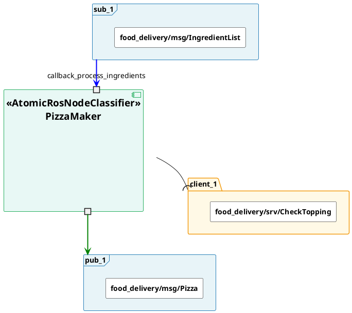
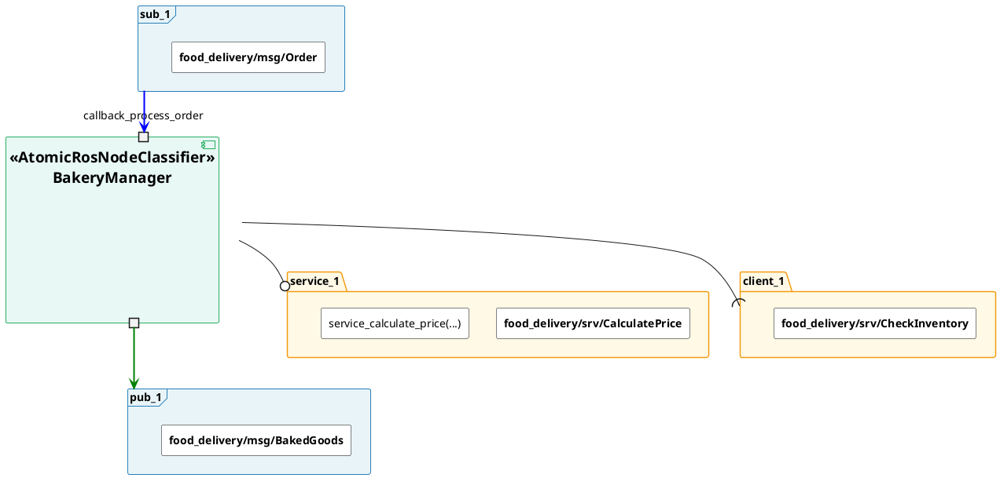
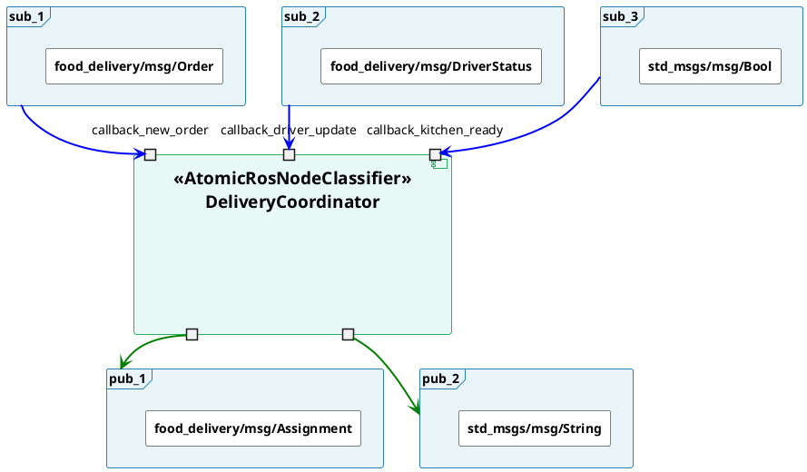
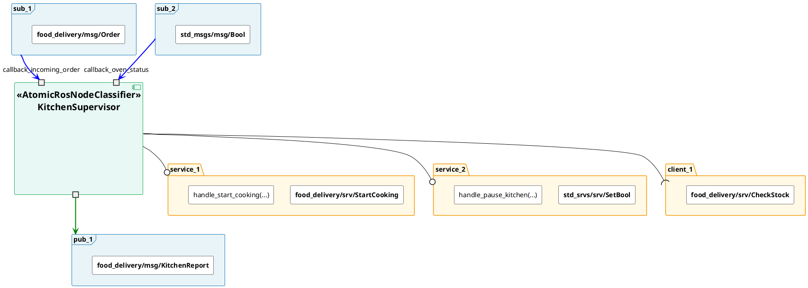
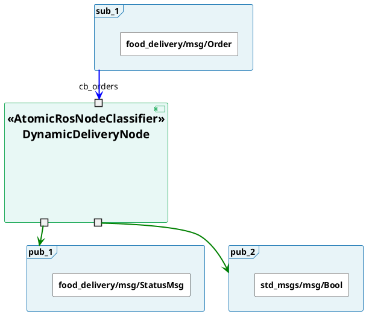

# ROS2 AtomicClassifierDiagram Generation Guide
# Input: Pre-Extracted Ports JSON → Output: PlantUML

---

## PURPOSE AND CRITICAL INSTRUCTION

This guide teaches you how to generate PlantUML AtomicClassifierDiagrams from a
**pre-extracted ports JSON** artifact. All examples use fictional Python-based ROS 2
nodes from the `food_delivery` package.

### YOU DO NOT READ SOURCE CODE

You receive a structured JSON file already containing every port with all details
pre-extracted. You call `load_node_ports_json(node_json_path="{node_json_path}")` ONCE,
read the JSON it returns, and immediately generate PlantUML from it.

**That is your entire job:**
```
load_node_ports_json  →  read JSON  →  generate PlantUML  →  return result
```

Do NOT call any other tool. Do NOT read `.py` files. Do NOT read `.cpp` files.
Do NOT infer or guess any port details. Trust the JSON completely.

---

## SECTION 1 — THE INPUT JSON SCHEMA

Every node arrives as a JSON with exactly this structure:

```json
{
  "classifier_name": "ClassName",
  "ports": [
    {
      "port_type": "Publisher",
      "identifier": "pub_1",
      "message_type": "pkg/msg/Type",
      "original_topic_name": "/actual/topic/name",
      "param_derived": false
    },
    {
      "port_type": "Subscriber",
      "identifier": "sub_1",
      "message_type": "pkg/msg/Type",
      "callback_function": "method_name",
      "original_topic_name": "/actual/topic/name",
      "param_derived": false
    },
    {
      "port_type": "Publisher",
      "identifier": "pub_2",
      "message_type": "pkg/msg/Type",
      "original_topic_name": "/default/topic/name",
      "param_derived": true,
      "param_name": "output_topic_param",
      "param_default": "/default/topic/name"
    },
    {
      "port_type": "Client",
      "identifier": "client_1",
      "service_type": "pkg/srv/Type",
      "original_service_name": "/actual/service/name",
      "param_derived": false
    },
    {
      "port_type": "Service",
      "identifier": "service_1",
      "service_type": "pkg/srv/Type",
      "service_function": "handler_method_name",
      "original_service_name": "/actual/service/name",
      "param_derived": false
    }
  ]
}
```

### Field definitions

| Field | Always present? | Meaning |
|-------|----------------|---------|
| `classifier_name` | YES | Python class name — use as component label |
| `ports` | YES | Array of all interface declarations |
| `port_type` | YES | One of: `"Publisher"`, `"Subscriber"`, `"Client"`, `"Service"` |
| `identifier` | YES | Sequential alias — `pub_1`, `pub_2`, `sub_1`, `sub_2`, `client_1`, `service_1` … |
| `message_type` | Publisher / Subscriber only | Fully qualified message type with `/` separators |
| `service_type` | Client / Service only | Fully qualified service type with `/` separators |
| `original_topic_name` | Publisher / Subscriber only | Resolved topic string — if `param_derived=true`, this holds the default value from `declare_parameter()`; if `false`, it is the literal string from `create_publisher`/`create_subscription` |
| `original_service_name` | Client / Service only | Resolved service string — same resolution rule as `original_topic_name` |
| `callback_function` | Subscriber only | Python method name of the subscription callback |
| `service_function` | Service only | Python method name of the service handler |
| `param_derived` | YES (always present) | `true` if the topic/service name is read at runtime via `get_parameter()` rather than a hard-coded string literal; `false` otherwise |
| `param_name` | When `param_derived=true` | The ROS parameter name declared with `declare_parameter(name, default)` |
| `param_default` | When `param_derived=true` | Default value string from `declare_parameter()` — MUST match `original_topic_name` / `original_service_name` |

### How `original_topic_name` is resolved when `param_derived=true`

When Crew 1 (the extractor) encounters a pattern like:
```python
self.declare_parameter('cmd_topic', '/cmd_vel')
topic = self.get_parameter('cmd_topic').get_parameter_value().string_value
self.sub = self.create_subscription(Twist, topic, self.callback, 10)
```

It traces the variable `topic` back to `declare_parameter` and stores:
- `original_topic_name`: `"/cmd_vel"` (the default value — the resolved name Crew 2 should use)
- `param_derived`: `true`
- `param_name`: `"cmd_topic"`
- `param_default`: `"/cmd_vel"`

**Rule**: `original_topic_name` is ALWAYS the name you use for alias building and frame display. The `param_*` fields are supplementary annotations only.

---

## SECTION 2 — COMPLETE JSON → PLANTUML MAPPING RULES

Read this section completely before generating any diagram.

### RULE 1 — `classifier_name` → component label

```
JSON:      "classifier_name": "PizzaMaker"

PlantUML:  component "<<AtomicRosNodeClassifier>>\nPizzaMaker" as node {
             ...ports go here...
           }
```

Always use `as node` — the alias is always `node` regardless of class name.

---

### RULE 2 — `"port_type": "Subscriber"` → portin + frame + blue arrow

```
JSON field        PlantUML element
─────────────     ──────────────────────────────────────────────────────
identifier        Port alias inside component:   portin "{callback_function}" as {identifier}
callback_function Port label inside component:   the text inside quotes before "as"
message_type      Rectangle text inside frame:   use exactly as-is (no conversion)
original_topic_name  Used to build a unique frame alias (see alias rule below)
```

**Step-by-step for a Subscriber:**

1. Inside the component block, add:
   ```plantuml
   portin "{callback_function}" as {identifier}
   ```
   Example: `portin "callback_process_order" as sub_1`

2. Outside the component block, declare the frame:
   ```plantuml
   frame "{identifier}" as topic_{alias_suffix} {
     rectangle "**{message_type}**" as t_{identifier}
   }
   ```
   Example:
   ```plantuml
   frame "sub_1" as topic_customer_orders {
     rectangle "**food_delivery/msg/Order**" as t_sub_1
   }
   ```

3. Write the connection (frame → port, blue):
   ```plantuml
   topic_{alias_suffix} -[#blue,bold]-> {identifier}
   ```
   Example: `topic_customer_orders -[#blue,bold]-> sub_1`

---

### RULE 3 — `"port_type": "Publisher"` → portout + frame + green arrow

```
JSON field        PlantUML element
─────────────     ──────────────────────────────────────────────────────
identifier        Port alias inside component:   portout " " as {identifier}
                  NOTE: port label is always a single space " " for publishers
message_type      Rectangle text inside frame:   use exactly as-is (no conversion)
original_topic_name  Used to build a unique frame alias
```

**Step-by-step for a Publisher:**

1. Inside the component block, add:
   ```plantuml
   portout " " as {identifier}
   ```
   Example: `portout " " as pub_1`

2. Outside the component block, declare the frame:
   ```plantuml
   frame "{identifier}" as topic_{alias_suffix} {
     rectangle "**{message_type}**" as t_{identifier}
   }
   ```
   Example:
   ```plantuml
   frame "pub_1" as topic_baked_goods {
     rectangle "**food_delivery/msg/BakedGoods**" as t_pub_1
   }
   ```

3. Write the connection (port → frame, green):
   ```plantuml
   {identifier} -[#green,bold]-> topic_{alias_suffix}
   ```
   Example: `pub_1 -[#green,bold]-> topic_baked_goods`

---

### RULE 4 — `"port_type": "Client"` → folder (rs#) + --( arrow

A service client calls an external service. It has NO port inside the component.

```
JSON field        PlantUML element
─────────────     ──────────────────────────────────────────────────────
identifier        Folder label AND alias suffix:   folder "{identifier}" as srv_{identifier}
service_type      Rectangle text inside folder:    use exactly as-is (no conversion)
original_service_name  Informational only — used to label the folder contents
```

**Step-by-step for a Client:**

1. Do NOT add any portin/portout inside the component block.

2. Outside the component block, declare the folder:
   ```plantuml
   folder "{identifier}" as srv_{identifier} {
     rectangle "**{service_type}**" as s_{identifier}
   }
   ```
   Example:
   ```plantuml
   folder "client_1" as srv_client_1 {
     rectangle "**food_delivery/srv/CheckInventory**" as s_client_1
   }
   ```

3. Write the connection using `--(`:
   ```plantuml
   node --( srv_{identifier}
   ```
   Example: `node --( srv_client_1`

---

### RULE 5 — `"port_type": "Service"` → folder (ps#) + --0 arrow + callback rectangle

A service server provides a service. It has NO port inside the component.
The handler function name is shown as an extra rectangle inside the folder.

```
JSON field        PlantUML element
─────────────     ──────────────────────────────────────────────────────
identifier        Folder label AND alias suffix:   folder "{identifier}" as srv_{identifier}
service_type      First rectangle inside folder:   use exactly as-is (no conversion)
service_function  Second rectangle inside folder:  "{service_function}(...)"
original_service_name  Informational only
```

**Step-by-step for a Service server:**

1. Do NOT add any portin/portout inside the component block.

2. Outside the component block, declare the folder with TWO rectangles:
   ```plantuml
   folder "{identifier}" as srv_{identifier} {
     rectangle "**{service_type}**" as s_{identifier}
     rectangle "{service_function}(...)" as sf_{identifier}
   }
   ```
   Example:
   ```plantuml
   folder "service_1" as srv_service_1 {
     rectangle "**food_delivery/srv/CalculatePrice**" as s_service_1
     rectangle "service_calculate_price(...)" as sf_service_1
   }
   ```

3. Write the connection using `--0`:
   ```plantuml
   node --0 srv_{identifier}
   ```
   Example: `node --0 srv_service_1`

---

### RULE 6 — message_type / service_type → use exactly as-is

Copy the `message_type` or `service_type` value from JSON **verbatim** into the rectangle label.
Do NOT convert `/` to `::`. Do NOT change any separators.

```
JSON value                       →   PlantUML rectangle label
──────────────────────────────      ──────────────────────────────────────────
food_delivery/msg/Order          →   food_delivery/msg/Order
sensor_msgs/msg/Image            →   sensor_msgs/msg/Image
std_msgs/msg/String              →   std_msgs/msg/String
std_srvs/srv/Empty               →   std_srvs/srv/Empty
food_delivery/srv/CalculatePrice →   food_delivery/srv/CalculatePrice
```

**Rule**: Use the `message_type` / `service_type` value exactly as it appears in the JSON.

---

### RULE 7 — original_topic_name / original_service_name → frame/folder alias suffix

Strip the leading `/`, replace remaining `/` and `-` with `_`.

```
original_topic_name     →   alias suffix
──────────────────────      ──────────────────────────────
/customer_orders        →   customer_orders
/camera/image_raw       →   camera_image_raw
/alice/io_states        →   alice_io_states
/perception/detected3d  →   perception_detected3d
/baked_goods            →   baked_goods
```

Use this suffix to build the full frame alias: `topic_{suffix}`
Use this suffix to comment the service folder content (for readability).

---

### RULE 8 — skinparam header (ALWAYS include exactly this)

Every diagram starts with `@startuml` and this exact skinparam block:

```plantuml
@startuml

skinparam rectangle {
  BackgroundColor #FFFFFF
  BorderColor #000000
  FontSize 14
}

skinparam frame {
  BackgroundColor #E8F4F8
  BorderColor #2980B9
  FontSize 14
}

skinparam folder {
  BackgroundColor #FFF9E6
  BorderColor #F39C12
  FontSize 14
}

skinparam component {
  BackgroundColor #E8F8F5
  BorderColor #27AE60
  FontSize 19
}

skinparam interface {
  BackgroundColor transparent
  BorderColor transparent
}
```

---

### RULE 9 — diagram structure order (ALWAYS follow this order)

```
@startuml
[skinparam block]
[component block with all portin/portout inside]
[frame declarations for all Subscribers]
[frame declarations for all Publishers]
[folder declarations for all Clients]
[folder declarations for all Services]
[connection lines — all connections AFTER all declarations]
@enduml
```

**All connections go at the bottom, AFTER all element declarations.**

---

### RULE 10 — `param_derived: true` → alias building only (no extra rectangle in diagram)

When a port entry has `"param_derived": true`, the topic/service name is resolved at runtime
from a ROS parameter. The `param_*` fields are present in the JSON for reference but are
**NOT rendered in the PlantUML diagram**.

**What stays the same:**
- `original_topic_name` / `original_service_name` holds the default value and is used **as-is**
  for alias building (apply Rule 7 sanitization exactly as normal).
- All frame/folder structure follows Rules 2–5 exactly as normal.

**What does NOT change in the diagram:**
- Do NOT add any extra rectangle for the parameter name.
- The frame/folder contains only the message/service type rectangle — same as when `param_derived=false`.

**Alias building stays identical** — use `param_default` value (which equals `original_topic_name`)
and apply Rule 7 sanitization. Do NOT put the parameter name in the alias.

```
original_topic_name  →  alias suffix    (param_default used, Rule 7 applied)
────────────────────    ─────────────────────────────────────────────────────
/incoming_orders     →  incoming_orders
/delivery_status     →  delivery_status
```

**Summary table:**

| `param_derived` | Extra rectangle inside block? | Alias source |
|-----------------|-------------------------------|--------------|
| `false` or absent | No | `original_topic_name` (Rule 7) |
| `true` | NO — param info stays in JSON only | `original_topic_name` = `param_default` (Rule 7) |

---

## SECTION 3 — WORKED EXAMPLES

---

### EXAMPLE A — PizzaMaker
**1 Subscriber + 1 Publisher + 1 Service Client**

#### A.1 Input JSON (`node_PizzaMaker.json`)

```json
{
  "classifier_name": "PizzaMaker",
  "ports": [
    {
      "port_type": "Subscriber",
      "identifier": "sub_1",
      "message_type": "food_delivery/msg/IngredientList",
      "callback_function": "callback_process_ingredients",
      "original_topic_name": "/ingredient_list"
    },
    {
      "port_type": "Publisher",
      "identifier": "pub_1",
      "message_type": "food_delivery/msg/Pizza",
      "original_topic_name": "/finished_pizzas"
    },
    {
      "port_type": "Client",
      "identifier": "client_1",
      "service_type": "food_delivery/srv/CheckTopping",
      "original_service_name": "/check_topping_stock"
    }
  ]
}
```

#### A.2 Mapping Table (how each JSON field becomes a PlantUML element)

| JSON entry | JSON value | PlantUML element produced |
|------------|-----------|--------------------------|
| `classifier_name` | `"PizzaMaker"` | `component "<<AtomicRosNodeClassifier>>\nPizzaMaker" as node` |
| `sub_1` → `port_type` | `"Subscriber"` | `portin "callback_process_ingredients" as sub_1` inside component |
| `sub_1` → `callback_function` | `"callback_process_ingredients"` | text label of the `portin` declaration |
| `sub_1` → `message_type` | `"food_delivery/msg/IngredientList"` | `rectangle "**food_delivery/msg/IngredientList**" as t_sub_1` inside `frame "sub_1"` |
| `sub_1` → `original_topic_name` | `"/ingredient_list"` | frame alias: `topic_ingredient_list` |
| `pub_1` → `port_type` | `"Publisher"` | `portout " " as pub_1` inside component |
| `pub_1` → `message_type` | `"food_delivery/msg/Pizza"` | `rectangle "**food_delivery/msg/Pizza**" as t_pub_1` inside `frame "pub_1"` |
| `pub_1` → `original_topic_name` | `"/finished_pizzas"` | frame alias: `topic_finished_pizzas` |
| `client_1` → `port_type` | `"Client"` | no port inside component; `folder "client_1" as srv_client_1` |
| `client_1` → `service_type` | `"food_delivery/srv/CheckTopping"` | `rectangle "**food_delivery/srv/CheckTopping**" as s_client_1` inside folder |
| connection for `sub_1` | blue, frame→port | `topic_ingredient_list -[#blue,bold]-> sub_1` |
| connection for `pub_1` | green, port→frame | `pub_1 -[#green,bold]-> topic_finished_pizzas` |
| connection for `client_1` | client connector | `node --( srv_client_1` |

#### A.3 Generated PlantUML (`node_PizzaMaker.puml`)



---

### EXAMPLE B — BakeryManager
**1 Subscriber + 1 Publisher + 1 Service Server + 1 Service Client**

#### B.1 Input JSON (`node_BakeryManager.json`)

```json
{
  "classifier_name": "BakeryManager",
  "ports": [
    {
      "port_type": "Subscriber",
      "identifier": "sub_1",
      "message_type": "food_delivery/msg/Order",
      "callback_function": "callback_process_order",
      "original_topic_name": "/customer_orders"
    },
    {
      "port_type": "Publisher",
      "identifier": "pub_1",
      "message_type": "food_delivery/msg/BakedGoods",
      "original_topic_name": "/baked_goods"
    },
    {
      "port_type": "Service",
      "identifier": "service_1",
      "service_type": "food_delivery/srv/CalculatePrice",
      "service_function": "service_calculate_price",
      "original_service_name": "/calculate_price"
    },
    {
      "port_type": "Client",
      "identifier": "client_1",
      "service_type": "food_delivery/srv/CheckInventory",
      "original_service_name": "/check_inventory"
    }
  ]
}
```

#### B.2 Mapping Table

| JSON entry | JSON value | PlantUML element produced |
|------------|-----------|--------------------------|
| `classifier_name` | `"BakeryManager"` | `component "<<AtomicRosNodeClassifier>>\nBakeryManager" as node` |
| `sub_1` → Subscriber | `callback_function: "callback_process_order"` | `portin "callback_process_order" as sub_1` |
| `sub_1` → message_type | `"food_delivery/msg/Order"` | `food_delivery/msg/Order` (as-is) in `frame "sub_1"` |
| `sub_1` → original_topic_name | `"/customer_orders"` | alias: `topic_customer_orders` |
| `pub_1` → Publisher | — | `portout " " as pub_1` |
| `pub_1` → message_type | `"food_delivery/msg/BakedGoods"` | `food_delivery/msg/BakedGoods` (as-is) in `frame "pub_1"` |
| `pub_1` → original_topic_name | `"/baked_goods"` | alias: `topic_baked_goods` |
| `service_1` → Service | `service_function: "service_calculate_price"` | NO port; `folder "service_1" as srv_service_1` with TWO rectangles |
| `service_1` → service_type | `"food_delivery/srv/CalculatePrice"` | `food_delivery/srv/CalculatePrice` (as-is) in folder |
| `service_1` → service_function | `"service_calculate_price"` | `rectangle "service_calculate_price(...)"` in folder |
| `client_1` → Client | — | NO port; `folder "client_1" as srv_client_1` with ONE rectangle |
| `client_1` → service_type | `"food_delivery/srv/CheckInventory"` | `food_delivery/srv/CheckInventory` (as-is) in folder |
| connections | — | blue for sub, green for pub, `--0` for service server, `--(` for client |

#### B.3 Generated PlantUML (`node_BakeryManager.puml`)



---

### EXAMPLE C — DeliveryCoordinator
**3 Subscribers + 2 Publishers (no services)**

This example shows how the identifier counters (sub_1, sub_2, sub_3, pub_1, pub_2) work
with multiple ports of the same type.

#### C.1 Input JSON (`node_DeliveryCoordinator.json`)

```json
{
  "classifier_name": "DeliveryCoordinator",
  "ports": [
    {
      "port_type": "Subscriber",
      "identifier": "sub_1",
      "message_type": "food_delivery/msg/Order",
      "callback_function": "callback_new_order",
      "original_topic_name": "/new_orders"
    },
    {
      "port_type": "Subscriber",
      "identifier": "sub_2",
      "message_type": "food_delivery/msg/DriverStatus",
      "callback_function": "callback_driver_update",
      "original_topic_name": "/driver_status"
    },
    {
      "port_type": "Subscriber",
      "identifier": "sub_3",
      "message_type": "std_msgs/msg/Bool",
      "callback_function": "callback_kitchen_ready",
      "original_topic_name": "/kitchen/ready"
    },
    {
      "port_type": "Publisher",
      "identifier": "pub_1",
      "message_type": "food_delivery/msg/Assignment",
      "original_topic_name": "/driver_assignment"
    },
    {
      "port_type": "Publisher",
      "identifier": "pub_2",
      "message_type": "std_msgs/msg/String",
      "original_topic_name": "/coordinator/status"
    }
  ]
}
```

#### C.2 Mapping Table

| JSON entry | identifier | PlantUML element |
|------------|-----------|-----------------|
| Subscriber | `sub_1` | `portin "callback_new_order" as sub_1` + `frame "sub_1" as topic_new_orders` |
| Subscriber | `sub_2` | `portin "callback_driver_update" as sub_2` + `frame "sub_2" as topic_driver_status` |
| Subscriber | `sub_3` | `portin "callback_kitchen_ready" as sub_3` + `frame "sub_3" as topic_kitchen_ready` |
| Publisher  | `pub_1` | `portout " " as pub_1` + `frame "pub_1" as topic_driver_assignment` |
| Publisher  | `pub_2` | `portout " " as pub_2` + `frame "pub_2" as topic_coordinator_status` |

Note how `/kitchen/ready` → alias `kitchen_ready` (strip leading `/`, replace inner `/` with `_`).
Note how `/coordinator/status` → alias `coordinator_status`.

#### C.3 Generated PlantUML (`node_DeliveryCoordinator.puml`)



---

### EXAMPLE D — KitchenSupervisor
**2 Subscribers + 1 Publisher + 2 Service Servers + 1 Service Client**

This is the most complete example. It shows all four port types together.

#### D.1 Input JSON (`node_KitchenSupervisor.json`)

```json
{
  "classifier_name": "KitchenSupervisor",
  "ports": [
    {
      "port_type": "Subscriber",
      "identifier": "sub_1",
      "message_type": "food_delivery/msg/Order",
      "callback_function": "callback_incoming_order",
      "original_topic_name": "/incoming_orders"
    },
    {
      "port_type": "Subscriber",
      "identifier": "sub_2",
      "message_type": "std_msgs/msg/Bool",
      "callback_function": "callback_oven_status",
      "original_topic_name": "/oven/status"
    },
    {
      "port_type": "Publisher",
      "identifier": "pub_1",
      "message_type": "food_delivery/msg/KitchenReport",
      "original_topic_name": "/kitchen/report"
    },
    {
      "port_type": "Service",
      "identifier": "service_1",
      "service_type": "food_delivery/srv/StartCooking",
      "service_function": "handle_start_cooking",
      "original_service_name": "/kitchen/start_cooking"
    },
    {
      "port_type": "Service",
      "identifier": "service_2",
      "service_type": "std_srvs/srv/SetBool",
      "service_function": "handle_pause_kitchen",
      "original_service_name": "/kitchen/pause"
    },
    {
      "port_type": "Client",
      "identifier": "client_1",
      "service_type": "food_delivery/srv/CheckStock",
      "original_service_name": "/warehouse/check_stock"
    }
  ]
}
```

#### D.2 Mapping Table

| JSON entry | identifier | port_type | PlantUML action |
|------------|-----------|-----------|----------------|
| sub_1 | `sub_1` | Subscriber | `portin "callback_incoming_order" as sub_1` + `frame "sub_1" as topic_incoming_orders` |
| sub_2 | `sub_2` | Subscriber | `portin "callback_oven_status" as sub_2` + `frame "sub_2" as topic_oven_status` |
| pub_1 | `pub_1` | Publisher | `portout " " as pub_1` + `frame "pub_1" as topic_kitchen_report` |
| service_1 | `service_1` | Service | NO port; `folder "service_1" as srv_service_1` with type + `handle_start_cooking(...)` |
| service_2 | `service_2` | Service | NO port; `folder "service_2" as srv_service_2` with type + `handle_pause_kitchen(...)` |
| client_1 | `client_1` | Client | NO port; `folder "client_1" as srv_client_1` with type only |

Connection summary:
- `topic_incoming_orders -[#blue,bold]-> sub_1`
- `topic_oven_status -[#blue,bold]-> sub_2`
- `pub_1 -[#green,bold]-> topic_kitchen_report`
- `node --0 srv_service_1`
- `node --0 srv_service_2`
- `node --( srv_client_1`

#### D.3 Generated PlantUML (`node_KitchenSupervisor.puml`)



---

### EXAMPLE E — DynamicDeliveryNode
**1 param-derived Subscriber + 1 param-derived Publisher + 1 literal-topic Publisher**

This example shows nodes that use `declare_parameter()` / `get_parameter()` to configure
their topic names at runtime. The JSON already contains the resolved defaults in
`original_topic_name`; the `param_*` fields are annotations only.

#### E.1 Source pattern that produced this JSON (informational — do NOT read source)

```python
class DynamicDeliveryNode(Node):
    def __init__(self):
        super().__init__('dynamic_delivery_node')
        self.declare_parameter('order_topic', '/incoming_orders')
        self.declare_parameter('status_topic', '/delivery_status')

        order_topic  = self.get_parameter('order_topic').get_parameter_value().string_value
        status_topic = self.get_parameter('status_topic').get_parameter_value().string_value

        self.sub_orders  = self.create_subscription(Order, order_topic, self.cb_orders, 10)
        self.pub_status  = self.create_publisher(StatusMsg, status_topic, 10)
        self.pub_heartbeat = self.create_publisher(Bool, '/heartbeat', 10)
```

#### E.2 Input JSON (`node_DynamicDeliveryNode.json`)

```json
{
  "classifier_name": "DynamicDeliveryNode",
  "ports": [
    {
      "port_type": "Subscriber",
      "identifier": "sub_1",
      "message_type": "food_delivery/msg/Order",
      "callback_function": "cb_orders",
      "original_topic_name": "/incoming_orders",
      "param_derived": true,
      "param_name": "order_topic",
      "param_default": "/incoming_orders"
    },
    {
      "port_type": "Publisher",
      "identifier": "pub_1",
      "message_type": "food_delivery/msg/StatusMsg",
      "original_topic_name": "/delivery_status",
      "param_derived": true,
      "param_name": "status_topic",
      "param_default": "/delivery_status"
    },
    {
      "port_type": "Publisher",
      "identifier": "pub_2",
      "message_type": "std_msgs/msg/Bool",
      "original_topic_name": "/heartbeat",
      "param_derived": false
    }
  ]
}
```

#### E.3 Mapping Table

| JSON entry | JSON value | PlantUML element produced |
|------------|-----------|--------------------------|
| `classifier_name` | `"DynamicDeliveryNode"` | `component "<<AtomicRosNodeClassifier>>\nDynamicDeliveryNode" as node` |
| `sub_1` → Subscriber | `callback_function: "cb_orders"` | `portin "cb_orders" as sub_1` inside component |
| `sub_1` → `original_topic_name` | `"/incoming_orders"` | frame alias: `topic_incoming_orders` |
| `sub_1` → `param_derived=true` | `param_name: "order_topic"` | param info stays in JSON only — NO extra rectangle in diagram |
| `pub_1` → Publisher | — | `portout " " as pub_1` inside component |
| `pub_1` → `original_topic_name` | `"/delivery_status"` | frame alias: `topic_delivery_status` |
| `pub_1` → `param_derived=true` | `param_name: "status_topic"` | param info stays in JSON only — NO extra rectangle in diagram |
| `pub_2` → Publisher | `param_derived: false` | `portout " " as pub_2` |
| `pub_2` → `original_topic_name` | `"/heartbeat"` | frame alias: `topic_heartbeat` |
| connections | blue sub, green pub | standard arrows per Rules 2–3 |

#### E.4 Generated PlantUML (`node_DynamicDeliveryNode.puml`)



Key points demonstrated:
- `sub_1` and `pub_1` have `param_derived: true` → alias built from `original_topic_name`; param info stays in JSON only — NO extra rectangle in diagram
- `pub_2` has `param_derived: false` → identical diagram output
- Alias building uses `original_topic_name` (= `param_default`) exactly as in Rule 7 for both cases

---

## SECTION 4 — CRITICAL RULES SUMMARY

### NEVER DO THESE

- Do NOT use `original_topic_name` as the port label (port label is callback name for sub, space for pub)
- Do NOT convert `/` to `::` in rectangle text — copy message_type / service_type exactly as-is
- Do NOT add portin/portout for Service or Client port types
- Do NOT use `frame` for services — services always use `folder`
- Do NOT call collect_node_diagram_context or read any source files
- Do NOT add a second rectangle (service_function) to Client folders — only Service folders get it
- Do NOT use runtime node name (e.g. `"pizza_maker_node"`) — always use `classifier_name`
- Do NOT guess or invent any port not present in the JSON `ports` array
- Do NOT use `param_name` as the frame alias — always build the alias from `original_topic_name` (Rule 7)
- Do NOT add a `"~param: ..."` rectangle for any port — param info stays in JSON only, never in the diagram
- Do NOT treat a `get_parameter()` variable name as the topic name — trust `original_topic_name` in JSON
- Do NOT leave `original_topic_name` empty or undefined when `param_derived=true` — the extractor (Crew 1) MUST populate it with `param_default`

### ALWAYS DO THESE

- Call `load_node_ports_json(node_json_path="{node_json_path}")` ONCE and trust it completely
- Use `as node` for the component alias — always `node`
- Port label for Subscriber = `callback_function` value from JSON
- Port label for Publisher = single space `" "`
- Frame label (visible text) = `identifier` (e.g. `"sub_1"`, `"pub_1"`)
- Frame alias = `topic_` + sanitized `original_topic_name` (Rule 7) — even when `param_derived=true`
- Folder alias for Client = `srv_` + `identifier` (e.g. `srv_client_1`)
- Folder alias for Service = `srv_` + `identifier` (e.g. `srv_service_1`)
- Service server connection = `node --0 srv_{identifier}`
- Service client connection = `node --( srv_{identifier}`
- Subscriber connection = `topic_{alias} -[#blue,bold]-> {identifier}`
- Publisher connection = `{identifier} -[#green,bold]-> topic_{alias}`
- All connections go AFTER all element declarations
- All rectangle aliases must be unique within the diagram
- When `param_derived=true`, build alias from `original_topic_name` as usual — do NOT add any extra rectangle; param info stays in JSON only

---

## SECTION 5 — QUICK REFERENCE CARD

```
port_type     inside component          outside component           connection
──────────    ──────────────────────    ───────────────────────     ──────────────────────────────────────
Subscriber    portin "CB" as sub_N      frame "sub_N" as topic_X    topic_X -[#blue,bold]->  sub_N
Publisher     portout " " as pub_N      frame "pub_N" as topic_Y    pub_N   -[#green,bold]-> topic_Y
Client        (nothing)                 folder "client_N" as srv_client_N    node --( srv_client_N
Service       (nothing)                 folder "service_N" as srv_service_N  node --0 srv_service_N
```

```
frame label (visible)  = identifier value from JSON  → e.g. "sub_1"
frame alias            = topic_ + sanitized(original_topic_name)  → e.g. topic_ingredient_list
folder alias           = srv_ + identifier  → e.g. srv_client_1
rectangle text         = **{type exactly as in JSON}**  → e.g. **food_delivery/msg/Pizza**
```

**Parameter-derived name (`param_derived` field):**

```
param_derived   extra rectangle inside frame/folder?   alias source
─────────────   ─────────────────────────────────────  ───────────────────────────────────────
false / absent  NO                                     original_topic_name (Rule 7)
true            NO — param info stays in JSON only     original_topic_name = param_default (Rule 7)
```

```
declare_parameter pattern in source  →  JSON fields produced by Crew 1
─────────────────────────────────────────────────────────────────────────
declare_parameter('cmd_topic', '/cmd_vel')         param_name: "cmd_topic"
get_parameter('cmd_topic').value  → used as topic  param_default: "/cmd_vel"
                                                   original_topic_name: "/cmd_vel"
                                                   param_derived: true
```

When you see `param_derived: true` — build the alias from `original_topic_name` as usual.
The `param_*` fields are for the JSON artifact only — never render them in the diagram.

---

## End of Guide

Apply these patterns exactly to generate accurate PlantUML AtomicClassifierDiagrams
for any Python-based ROS 2 node. All information comes from the JSON — never from source code.
